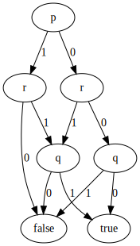
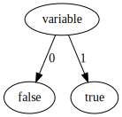
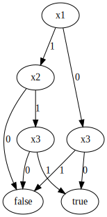
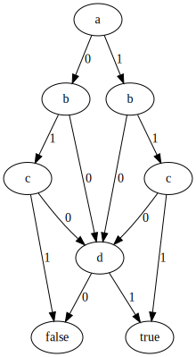

# README

Author: 袁玉润

## Introduction

This project is intended to parse the input propositional logic formula and generate the corresponding Reduced Ordered Binary Decision Diagram(ROBDD). 

For instance, the input formula $(p\rightarrow r)\wedge (q \leftrightarrow (r \vee p))$ would lead to the following output

```DOT
digraph{
    0 [label="false"]
    1 [label="true"]
    2 [label="p"]
    3 [label="r"]
    4 [label="r"]
    2 -> 3 [label="0"]
    2 -> 4 [label="1"]
    5 [label="q"]
    6 [label="q"]
    3 -> 5 [label="0"]
    3 -> 6 [label="1"]
    5 -> 1 [label="0"]
    5 -> 0 [label="1"]
    6 -> 0 [label="0"]
    6 -> 1 [label="1"]
    4 -> 0 [label="0"]
    4 -> 6 [label="1"]
}
```

which is [DOT](http://www.graphviz.org/doc/info/lang.html) code. To visualize the diagram, one choice is to paste the generated code to [Viz.js (viz-js.com)](http://viz-js.com/). The example show above would generate the following graph



### The Formula Grammar

#### Operators

The supported operations (in descending priority order): 

1. `!` Not
2. `&` And
3. `|` Or
4. `->` Implication, `<->` Equivalence

Parentheses `(`, `)` can be used to alter the priority of the subexpressions. 

#### Variables and Constants

The identifier of the variables should **consist of case-sensitive alphabetic characters** (`[a-zA-Z]+`). 

2 names are reserved: `T` for true and `F` for false. 

For instance: 

1. `T -> F`

   

2. `p -> F`

   

## Build

The project is written completely in [Rust Programming Language](https://www.rust-lang.org/). To build the project from source, follow the instructions on [Install Rust](https://www.rust-lang.org/tools/install) to get the Rust compilation toolchain. The installation is supposed to be easy. If you do not want to rebuild the project, you can run the binary files located in directory `bin` (see [Run](#Run)). 

With the tool chain ready, simply use `cargo ` to build and run the program. One thing to notice is that the file `src/formula_parser/grammar.rs` is generated by [lalrpop/lalrpop: LR(1) parser generator for Rust (github.com)](https://github.com/lalrpop/lalrpop) from `src/formula_parser/grammar.lalrpop`. If you change the contents in `grammar.lalrpop`, a conversion is needed to update the `grammar.rs`. The following instructions should do the work: 

```bash
$ cargo install lalrpop 		# only if you have not installed it
$ lalrpop grammar.lalrpop
```

## Run

The released `x86_linux-gnu` binary is located at `bin/command_line_interface`. 

After executing the program, input the propositional logic formula and then hit `Enter`. 


## Examples & Tests

1. `F`

   

2. `variable`

   

   

3. `(x1 | !x3) & (!x1 | x2) & (!x1 | !x2 | x3)`

   

4. `x1 & x2 | x3 & x4 | x5 & x6 | x7 & x8`

   

5. `a & b & c | !b & d | !c & d`

   

## Acknowledgement